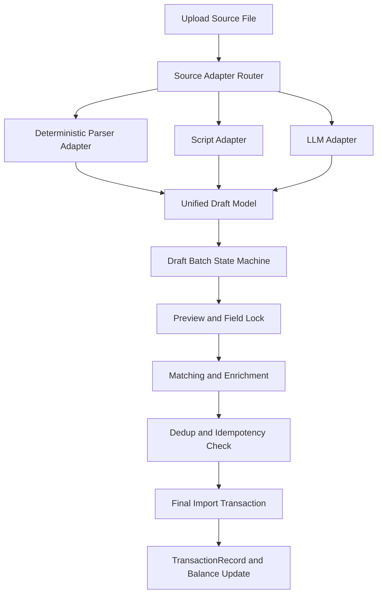
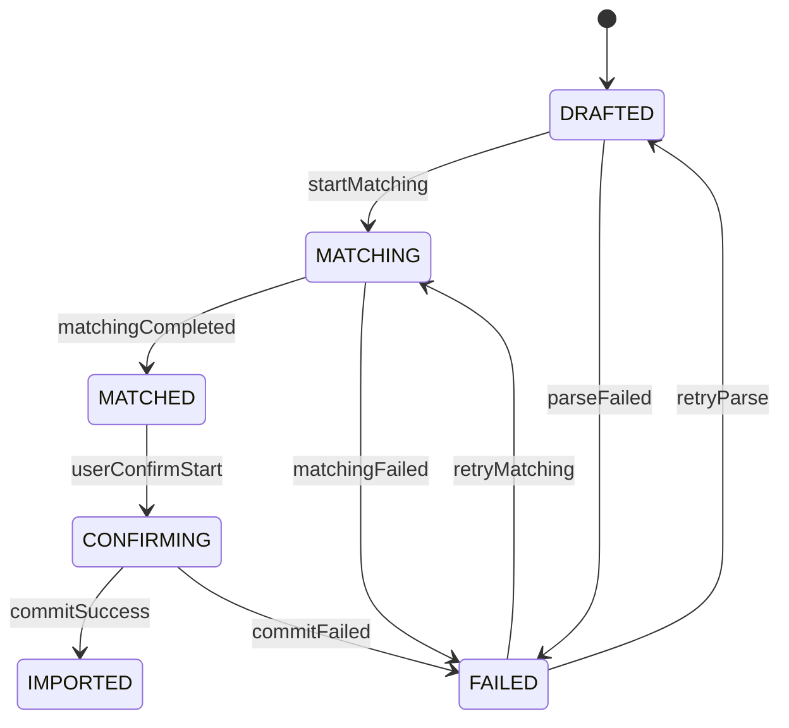

# Unified Import Model V1

Feature Name: llm-import-unified-model
Updated: 2026-05-07

## Description

本设计用于收敛 `qing-service-llm` 当前双轨导入流程：

- 旧链路：`/api/bills/*` + `TransactionRecord(uploadId)`
- 新链路：`/api/llm/parser/*` + `LlmParseRecord/LlmParseDetail`

核心目标是建立“统一草稿模型 + 导入状态机 + 前后端统一契约”，使解析能力（解析器/脚本/LLM）与入账能力解耦。

## Architecture

### Layer Responsibilities

1. Source Adapter Layer
   - 输入来源文件
   - 输出统一草稿记录
   - 不触发正式交易写入

2. Draft Workflow Layer
   - 驱动批次状态机
   - 管理字段锁定与审计
   - 提供前端动作约束

3. Final Import Layer
   - 事务化执行去重与入账
   - 幂等保护
   - 账户余额联动

## Components and Interfaces

### 1. DraftBatchService (new)

- 职责: 管理导入批次生命周期与状态迁移
- 核心接口:
  - `createBatch(sourceMeta, adapterType)`
  - `transition(batchId, action)`
  - `getBatchDetail(batchId)`

### 2. DraftRecordService (new)

- 职责: 管理草稿记录、锁定信息、人工确认信息
- 核心接口:
  - `saveDraftRecords(batchId, List<UnifiedDraftRecord>)`
  - `lockFields(batchId, recordId, fieldLocks)`
  - `applyUserEdits(batchId, edits)`

### 3. AdapterRouterService (new)

- 职责: 路由不同来源到解析器/脚本/LLM 适配器
- 核心接口:
  - `route(fileMeta): AdapterType`
  - `adapt(file, adapterType): List<UnifiedDraftRecord>`

### 4. MatchingOrchestratorService (new)

- 职责: 对未锁定字段执行规则匹配与增强
- 核心接口:
  - `runMatching(batchId)`
  - `rerunMatching(batchId, unlockedScope)`

### 5. ImportCommitService (new)

- 职责: 执行去重、幂等校验与正式入账
- 核心接口:
  - `commit(batchId, commitOptions)`

### 6. Existing Services Integration

- `LlmBillParserFacade`
  - 从“直接保存 LlmParseDetail”调整为“产出统一草稿记录并入批次”
- `UploadService`
  - 拆分旧逻辑，保留与正式交易相关的稳定能力

## Data Models

### UnifiedDraftBatch (new table)

- `id`
- `batchNo`
- `sourceType`
- `adapterType` (`PARSER` | `SCRIPT` | `LLM`)
- `adapterVersion`
- `status` (`DRAFTED` | `MATCHING` | `MATCHED` | `CONFIRMING` | `IMPORTED` | `FAILED`)
- `progress`
- `totalRecords`
- `needReviewCount`
- `lockedCount`
- `errorCode`
- `errorMessage`
- `createdAt`
- `updatedAt`

### UnifiedDraftRecord (new table)

- `id`
- `batchId`
- `idempotencyKey` (交易级幂等键)
- `rawPayload` (原始片段)
- `factAmount`
- `factTime`
- `factCounterparty`
- `factDescription`
- `suggestedType`
- `suggestedCategoryId`
- `suggestedAccountId`
- `suggestedTags`
- `confidence`
- `needReview`
- `lockMap` (JSON)
- `userEditMap` (JSON)
- `reviewStatus` (`PENDING` | `CONFIRMED` | `REJECTED`)
- `importStatus` (`NOT_IMPORTED` | `IMPORTED` | `DUPLICATED`)
- `createdAt`
- `updatedAt`

### DraftTask (new table)

- `taskId`
- `batchId`
- `taskType` (`PARSE` | `MATCH`)
- `status` (`PENDING` | `RUNNING` | `COMPLETED` | `FAILED`)
- `progress`
- `errorCode`
- `errorMessage`
- `startedAt`
- `finishedAt`

## State Machine

### Allowed Actions by State

- `DRAFTED`
  - allow: preview, field lock, start matching
- `MATCHING`
  - allow: progress query, cancel matching
- `MATCHED`
  - allow: lock/unlock, apply edits, start confirm
- `CONFIRMING`
  - allow: dedup preview, commit import
- `IMPORTED`
  - allow: read-only query
- `FAILED`
  - allow: retry from failed stage

## Frontend-Backend Contract V1

### APIs

1. `POST /api/import/draft/batches`
   - 创建导入批次并触发适配

2. `GET /api/import/draft/batches/{batchId}`
   - 返回批次状态、可执行动作、统计信息

3. `GET /api/import/draft/batches/{batchId}/records`
   - 分页返回草稿记录

4. `POST /api/import/draft/batches/{batchId}/matching`
   - 触发匹配任务

5. `POST /api/import/draft/batches/{batchId}/locks`
   - 锁定或解锁字段

6. `POST /api/import/draft/batches/{batchId}/confirm`
   - 提交人工确认和修改

7. `POST /api/import/draft/batches/{batchId}/commit`
   - 执行去重和正式入账

8. `GET /api/import/tasks/{taskId}`
   - 查询异步任务状态

## Correctness Properties

1. Invariant: `IMPORTED` 批次不得再次入账。
2. Invariant: 锁定字段不得被自动匹配覆盖。
3. Invariant: 正式入账前不得更新账户余额。
4. Invariant: 同一 `idempotencyKey` 在同账本中最多存在一条正式交易。

## Error Handling

1. Adapter Parse Error
   - 保存失败批次与错误信息
   - 状态置 `FAILED`

2. Matching Runtime Error
   - 保留已完成记录
   - 支持从 `FAILED` 重试

3. Commit Conflict Error
   - 返回冲突列表与重复依据
   - 不执行部分写入

4. Illegal State Transition
   - 返回当前状态和允许动作

## Test Strategy

1. Unit Tests
   - 状态机迁移合法性
   - 字段锁定覆盖规则
   - 幂等键去重逻辑

2. Integration Tests
   - 批次从创建到入账完整链路
   - 并发重复提交保护
   - 服务重启后任务状态恢复

3. Contract Tests
   - 前后端接口字段一致性
   - 可执行动作与状态同步

## Migration Plan (Incremental)

### Phase A - 新模型落地

1. 引入 `UnifiedDraftBatch/UnifiedDraftRecord/DraftTask` 表与实体
2. 新增 `/api/import/draft/*` 接口，不替换旧接口

### Phase B - LLM 流程接入统一草稿

1. `LlmBillParserFacade` 改为写统一草稿记录
2. `LlmParseRecord/LlmParseDetail` 逐步降级为兼容视图或历史数据

### Phase C - 旧导入流程适配

1. `UploadService` 的预览和匹配写入统一草稿
2. 正式入账逻辑迁移到 `ImportCommitService`

### Phase D - 前端迁移

1. `finance-web` 导入页面改为状态机驱动
2. 页面只按当前状态显示动作

### Phase E - 收口旧接口

1. 标记 `/api/bills/*` 老流程为 deprecated
2. 灰度完成后下线老入口
