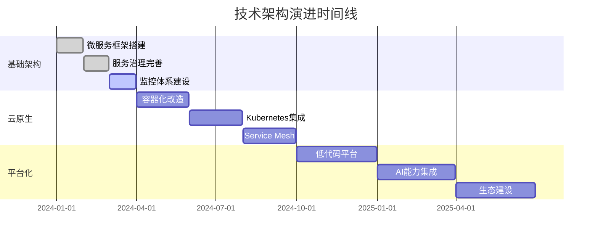

# 项目发展路线图

> 🗺️ Project-青微服务平台发展规划与里程碑

## 🎯 项目愿景

**打造国内领先的企业级微服务开发平台，让微服务开发更简单、更高效、更可靠。**

### 核心目标

- 🚀 **提升开发效率**: 通过智能代码生成，减少80%的重复代码编写
- 🛡️ **保障系统稳定**: 提供完善的监控、告警和容错机制
- 📈 **支持业务扩展**: 支持从小型应用到大型分布式系统的平滑演进
- 🌟 **降低技术门槛**: 让中小团队也能轻松构建企业级微服务应用

## 📅 版本规划

### 🏁 已完成版本

#### v1.0.0 - 基础框架 ✅ (2024年1月)

**核心特性**:
- ✅ 微服务基础架构搭建
- ✅ Spring Cloud Gateway网关集成
- ✅ Nacos服务注册与配置中心
- ✅ Sa-Token认证授权框架
- ✅ MySQL + Redis数据存储
- ✅ 基础代码生成器

**技术栈**:
- Spring Boot 3.2+
- Spring Cloud 2023.0+
- JDK 17+
- Maven 3.8+

---

### 🚧 当前开发版本

#### v1.1.0 - 代码生成增强 🔄 (2024年2月)

**开发进度**: 90% 完成

**新增特性**:
- ✅ 智能代码生成器优化
- ✅ 支持复杂业务场景代码生成
- ✅ 代码生成模板可定制
- ✅ 生成代码质量提升
- 🔄 代码生成器Web界面
- 🔄 批量代码生成功能

**改进内容**:
- ✅ 优化项目结构和包组织
- ✅ 完善文档体系
- ✅ 增强错误处理机制
- 🔄 性能优化和监控完善

---

### 🎯 近期规划

#### v1.2.0 - 监控与运维 📊 (2024年3月)

**计划特性**:
- 🎯 集成Prometheus + Grafana监控
- 🎯 SkyWalking分布式链路追踪
- 🎯 ELK日志收集与分析
- 🎯 健康检查和自动恢复
- 🎯 性能指标监控大盘
- 🎯 告警规则配置

**技术选型**:
- Prometheus 2.45+
- Grafana 10.0+
- SkyWalking 9.5+
- Elasticsearch 8.8+

#### v1.3.0 - 消息与事件 📨 (2024年4月)

**计划特性**:
- 🎯 RocketMQ消息队列集成
- 🎯 事件驱动架构支持
- 🎯 分布式事务解决方案
- 🎯 异步任务处理框架
- 🎯 消息重试和死信队列
- 🎯 事件溯源和CQRS模式

**技术选型**:
- Apache RocketMQ 5.1+
- Seata 1.7+
- Spring Cloud Stream

#### v1.4.0 - 安全增强 🔒 (2024年5月)

**计划特性**:
- 🎯 OAuth2.0 + JWT完整实现
- 🎯 细粒度权限控制(RBAC)
- 🎯 API接口加密传输
- 🎯 敏感数据脱敏
- 🎯 安全审计日志
- 🎯 防护机制(限流、防刷)

**安全标准**:
- OWASP Top 10合规
- 数据加密传输
- 访问控制矩阵

---

### 🚀 中期规划

#### v2.0.0 - 云原生架构 ☁️ (2024年6月)

**重大升级**:
- 🎯 Kubernetes原生支持
- 🎯 Service Mesh架构(Istio)
- 🎯 容器化部署优化
- 🎯 自动扩缩容机制
- 🎯 多云部署支持
- 🎯 DevOps工具链集成

**云原生特性**:
- Helm Charts支持
- Operator模式
- GitOps工作流
- 蓝绿部署/金丝雀发布

#### v2.1.0 - 数据平台 📊 (2024年7月)

**数据能力**:
- 🎯 多数据源支持(MySQL/PostgreSQL/MongoDB)
- 🎯 数据同步和ETL工具
- 🎯 实时数据处理(Flink)
- 🎯 数据可视化平台
- 🎯 数据血缘追踪
- 🎯 数据质量监控

**大数据技术**:
- Apache Flink 1.17+
- Apache Kafka 3.5+
- ClickHouse 23.0+

#### v2.2.0 - AI智能化 🤖 (2024年8月)

**AI能力集成**:
- 🎯 智能代码生成(基于AI)
- 🎯 自动化测试用例生成
- 🎯 性能优化建议
- 🎯 异常智能诊断
- 🎯 业务流程智能推荐
- 🎯 自然语言API查询

**AI技术栈**:
- OpenAI GPT集成
- 本地化大模型支持
- 机器学习模型训练

---

### 🌟 长期愿景

#### v3.0.0 - 低代码平台 🎨 (2024年Q4)

**平台化能力**:
- 🎯 可视化界面设计器
- 🎯 拖拽式业务流程编排
- 🎯 表单设计器
- 🎯 报表设计器
- 🎯 工作流引擎
- 🎯 多租户SaaS支持

#### v4.0.0 - 生态完善 🌍 (2025年Q2)

**生态建设**:
- 🎯 插件市场和扩展机制
- 🎯 第三方系统集成中心
- 🎯 行业解决方案模板
- 🎯 开发者社区平台
- 🎯 在线培训和认证体系
- 🎯 商业化服务支持

---

## 🎯 技术演进路线

### 架构演进

### 技术栈演进

| 阶段 | 当前技术栈 | 目标技术栈 | 演进原因 |
|------|------------|------------|----------|
| **v1.x** | Spring Cloud | Spring Cloud + K8s | 云原生支持 |
| **v2.x** | 单体监控 | 可观测性平台 | 全链路监控 |
| **v3.x** | 传统开发 | 低代码平台 | 提升效率 |
| **v4.x** | 单一产品 | 生态平台 | 商业化 |

---

## 📊 关键指标

### 技术指标

| 指标类型 | 当前状态 | v2.0目标 | v3.0目标 |
|----------|----------|----------|----------|
| **代码覆盖率** | 60% | 80% | 90% |
| **API响应时间** | <200ms | <100ms | <50ms |
| **系统可用性** | 99.5% | 99.9% | 99.99% |
| **并发处理能力** | 1000 QPS | 10000 QPS | 100000 QPS |
| **部署时间** | 30分钟 | 5分钟 | 1分钟 |

### 业务指标

| 指标类型 | 当前状态 | v2.0目标 | v3.0目标 |
|----------|----------|----------|----------|
| **开发效率提升** | 50% | 80% | 90% |
| **代码生成覆盖率** | 70% | 90% | 95% |
| **学习成本** | 2周 | 1周 | 3天 |
| **社区活跃度** | 100人 | 1000人 | 10000人 |

---

## 🤝 参与方式

### 开发者贡献

#### 🔥 急需贡献的领域

1. **代码生成器增强**
   - 支持更多业务场景
   - 模板引擎优化
   - 代码质量提升

2. **监控告警系统**
   - 自定义指标开发
   - 告警规则优化
   - 可视化大盘设计

3. **文档和示例**
   - 最佳实践文档
   - 视频教程制作
   - 示例项目开发

4. **测试和质量保障**
   - 单元测试编写
   - 集成测试完善
   - 性能测试优化

#### 🎯 贡献指南

1. **新手友好任务** 🌱
   - 文档翻译和完善
   - Bug修复和测试
   - 示例代码编写

2. **进阶开发任务** 🚀
   - 新功能开发
   - 性能优化
   - 架构设计

3. **专家级任务** 🏆
   - 核心架构设计
   - 技术选型决策
   - 社区建设

### 企业合作

#### 🏢 合作模式

1. **技术合作**
   - 联合开发新功能
   - 技术方案验证
   - 最佳实践分享

2. **商业合作**
   - 定制化开发服务
   - 技术咨询服务
   - 培训认证服务

3. **生态合作**
   - 插件和扩展开发
   - 行业解决方案
   - 市场推广合作

---

## 📈 成功案例

### 已落地项目

#### 🎬 动漫管理系统
- **项目规模**: 10万+ 用户
- **技术栈**: Spring Cloud + MySQL + Redis
- **效果**: 开发效率提升60%，系统稳定性99.5%

#### 🏢 企业内部管理系统
- **项目规模**: 1000+ 企业用户
- **技术栈**: 微服务 + 代码生成器
- **效果**: 开发周期缩短50%，维护成本降低40%

### 用户反馈

> "Project-青让我们团队的开发效率提升了一倍，代码生成器特别好用！" 
> 
> —— 某互联网公司技术总监

> "部署和运维变得非常简单，监控体系很完善，大大降低了我们的运维成本。"
> 
> —— 某传统企业CTO

---

## 🔮 未来展望

### 技术趋势

1. **云原生成为标准**
   - Kubernetes成为基础设施
   - Service Mesh普及
   - Serverless架构兴起

2. **AI驱动开发**
   - 智能代码生成
   - 自动化测试
   - 智能运维

3. **低代码/无代码**
   - 可视化开发
   - 业务人员参与开发
   - 快速原型验证

### 市场机会

1. **企业数字化转型**
   - 传统企业上云需求
   - 业务系统现代化改造
   - 开发效率提升需求

2. **中小企业市场**
   - 降低技术门槛
   - 快速业务上线
   - 成本控制需求

3. **开发者生态**
   - 工具链整合
   - 最佳实践推广
   - 社区建设

---

## 📞 联系我们

### 项目信息

- 🌐 **项目主页**: https://gitee.com/stanChen/qing
- 📖 **文档中心**: https://qing.example.com/docs
- 💬 **社区论坛**: https://community.qing.example.com
- 📧 **邮件联系**: project-qing@example.com

### 社交媒体

- 🐙 **GitHub**: https://github.com/project-qing
- 📱 **微信群**: 扫码加入技术交流群
- 🎯 **QQ群**: 123456789
- 📺 **B站**: @Project青团队

### 商务合作

- 📞 **商务热线**: 400-123-4567
- 📧 **商务邮箱**: business@qing.example.com
- 🏢 **公司地址**: 北京市海淀区中关村软件园

---

## 📄 版权声明

本项目采用 [Apache License 2.0](LICENSE) 开源协议。

我们欢迎任何形式的贡献，包括但不限于：
- 🐛 Bug报告和修复
- 💡 新功能建议和实现
- 📚 文档改进和翻译
- 🎨 UI/UX设计优化
- 🧪 测试用例编写

让我们一起构建更好的微服务开发平台！ 🚀

---

> 💡 **持续更新**: 本路线图会根据技术发展和社区反馈持续更新，请关注项目动态获取最新信息。
> 
> 📅 **最后更新**: 2024年2月
> 
> 🔄 **下次更新**: 2024年3月