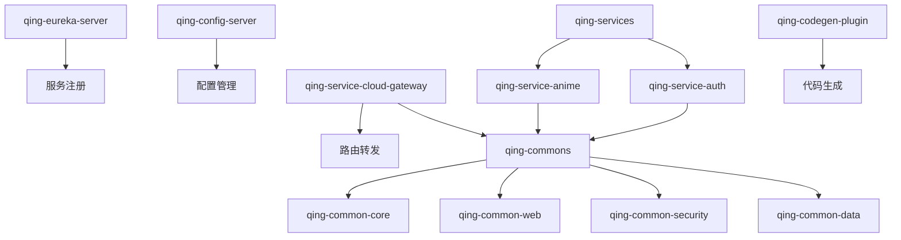

# 项目结构说明

本文档详细介绍青（Qing）项目的整体架构和目录结构，帮助开发者快速了解项目组织方式。

## 🏗️ 整体架构

青（Qing）项目采用微服务架构，基于 Spring Cloud 生态构建，主要包含以下核心组件：

```
┌─────────────────┐    ┌─────────────────┐    ┌─────────────────┐
│   Web 前端      │    │   移动端应用     │    │   第三方系统     │
└─────────────────┘    └─────────────────┘    └─────────────────┘
         │                       │                       │
         └───────────────────────┼───────────────────────┘
                                 │
                    ┌─────────────────┐
                    │  API Gateway    │  ← 统一入口
                    │  (Spring Cloud  │
                    │   Gateway)      │
                    └─────────────────┘
                                 │
              ┌──────────────────┼──────────────────┐
              │                  │                  │
    ┌─────────────────┐ ┌─────────────────┐ ┌─────────────────┐
    │   动漫服务       │ │   认证服务       │ │   其他业务服务   │
    │  (Anime)        │ │   (Auth)        │ │                │
    └─────────────────┘ └─────────────────┘ └─────────────────┘
              │                  │                  │
              └──────────────────┼──────────────────┘
                                 │
                    ┌─────────────────┐
                    │  服务注册中心    │
                    │   (Eureka)      │
                    └─────────────────┘
```

## 📁 目录结构

### 根目录结构

```
qing/
├── qing-eureka-server/          # 服务注册中心
├── qing-config-server/          # 配置中心
├── qing-service-cloud-gateway/  # API 网关
├── qing-services/               # 业务服务模块
├── qing-commons/                # 公共组件
├── qing-starters/               # 自定义 Starter
├── qing-codegen-plugin/         # 代码生成插件
├── qing-infrastructure/         # 基础设施层
├── qing-domain-common/          # 领域公共模块
├── qing-feign/                  # Feign 客户端
├── docs/                        # 项目文档
├── scripts/                     # 部署脚本
├── checkstyle/                  # 代码检查配置
├── .editorconfig               # 编辑器配置
├── .gitignore                  # Git 忽略文件
├── pom.xml                     # Maven 主配置
└── README.md                   # 项目说明
```

### 核心模块详解

#### 1. 服务注册中心 (qing-eureka-server)

```
qing-eureka-server/
├── src/main/java/
│   └── xyz/stanic/qing/eureka/
│       └── EurekaServerApplication.java
├── src/main/resources/
│   ├── application.yml
│   └── bootstrap.yml
├── Dockerfile
└── pom.xml
```

#### 2. 配置中心 (qing-config-server)

```
qing-config-server/
├── src/main/java/
│   └── xyz/stanic/qing/config/
│       └── ConfigServerApplication.java
├── src/main/resources/
│   ├── application.yml
│   └── config/                  # 配置文件存储
├── Dockerfile
└── pom.xml
```

#### 3. API 网关 (qing-service-cloud-gateway)

```
qing-service-cloud-gateway/
├── src/main/java/
│   └── xyz/stanic/qing/gateway/
│       ├── GatewayApplication.java
│       ├── config/              # 网关配置
│       ├── filter/              # 自定义过滤器
│       └── handler/             # 异常处理器
├── src/main/resources/
│   └── application.yml
└── pom.xml
```

#### 4. 业务服务 (qing-services)

```
qing-services/
├── qing-service-anime/          # 动漫服务
│   ├── qing-service-anime-api/  # API 接口定义
│   └── qing-service-anime-app/  # 服务实现
├── qing-service-auth/           # 认证服务
│   ├── qing-service-auth-api/
│   └── qing-service-auth-app/
└── pom.xml
```

##### 单个服务结构 (以动漫服务为例)

```
qing-service-anime-app/
├── src/main/java/
│   └── xyz/stanic/qing/anime/
│       ├── AnimeServiceApplication.java
│       ├── controller/          # 控制器层
│       ├── service/             # 服务层
│       ├── repository/          # 数据访问层
│       ├── domain/              # 领域模型
│       ├── dto/                 # 数据传输对象
│       ├── config/              # 配置类
│       └── exception/           # 异常处理
├── src/main/resources/
│   ├── application.yml
│   ├── bootstrap.yml
│   └── mapper/                  # MyBatis 映射文件
├── src/test/                    # 测试代码
├── Dockerfile
└── pom.xml
```

#### 5. 公共组件 (qing-commons)

```
qing-commons/
├── qing-common-core/            # 核心工具类
│   ├── src/main/java/
│   │   └── xyz/stanic/qing/common/core/
│   │       ├── util/            # 工具类
│   │       ├── constant/        # 常量定义
│   │       ├── exception/       # 异常定义
│   │       └── result/          # 统一返回结果
│   └── pom.xml
├── qing-common-web/             # Web 相关组件
├── qing-common-security/        # 安全组件
├── qing-common-data/            # 数据访问组件
└── pom.xml
```

#### 6. 代码生成插件 (qing-codegen-plugin)

```
qing-codegen-plugin/
├── src/main/java/
│   └── xyz/stanic/qing/codegen/
│       ├── CodegenMojo.java     # Maven 插件主类
│       ├── generator/           # 代码生成器
│       ├── template/            # 模板引擎
│       └── config/              # 配置解析
├── src/main/resources/
│   └── templates/               # 代码模板
├── example/                     # 使用示例
└── pom.xml
```

## 🎯 设计原则

### 1. 分层架构

每个服务都采用经典的分层架构：

- **Controller 层**：处理 HTTP 请求，参数验证
- **Service 层**：业务逻辑处理
- **Repository 层**：数据访问
- **Domain 层**：领域模型和业务规则

### 2. 依赖管理

- **父 POM**：统一管理依赖版本
- **BOM**：提供依赖清单
- **Starter**：封装常用配置

### 3. 配置管理

- **本地配置**：`application.yml`
- **远程配置**：Spring Cloud Config
- **环境隔离**：通过 Profile 区分环境

### 4. 服务通信

- **同步调用**：Feign 客户端
- **异步消息**：RabbitMQ
- **服务发现**：Eureka

## 📦 模块依赖关系



## 🚀 快速导航

- [开发环境搭建](./environment-setup) - 配置开发环境
- [快速开始](./quick-start) - 运行第一个服务
- [编码规范](./coding-standards) - 了解编码规范
- [API 设计规范](./api-standards) - API 设计指南

---

通过理解项目结构，您可以更好地进行开发和维护工作。如有疑问，请参考其他开发指南或在 GitHub 上提出 Issue。
