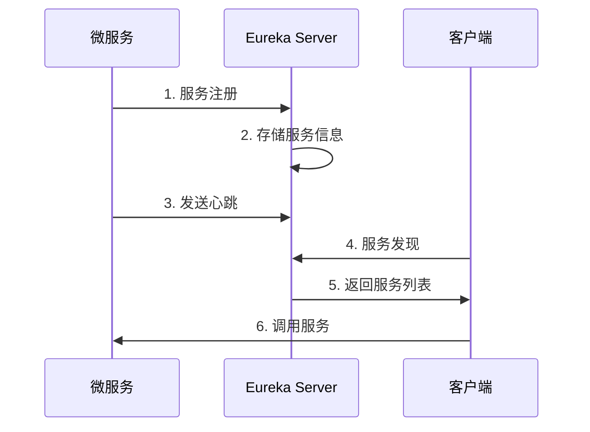
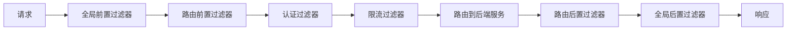
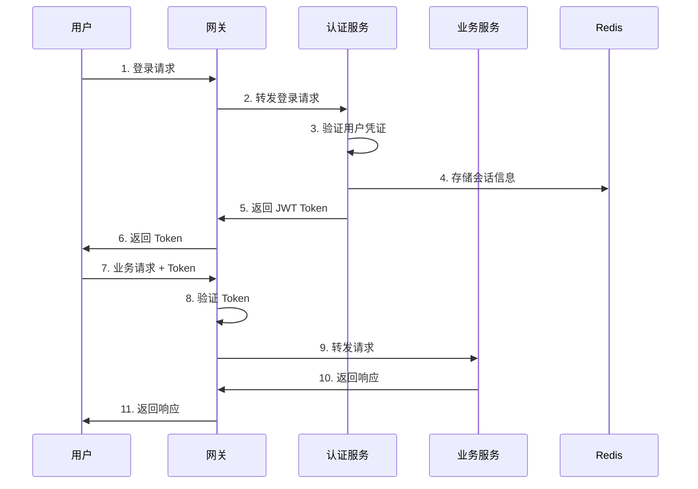
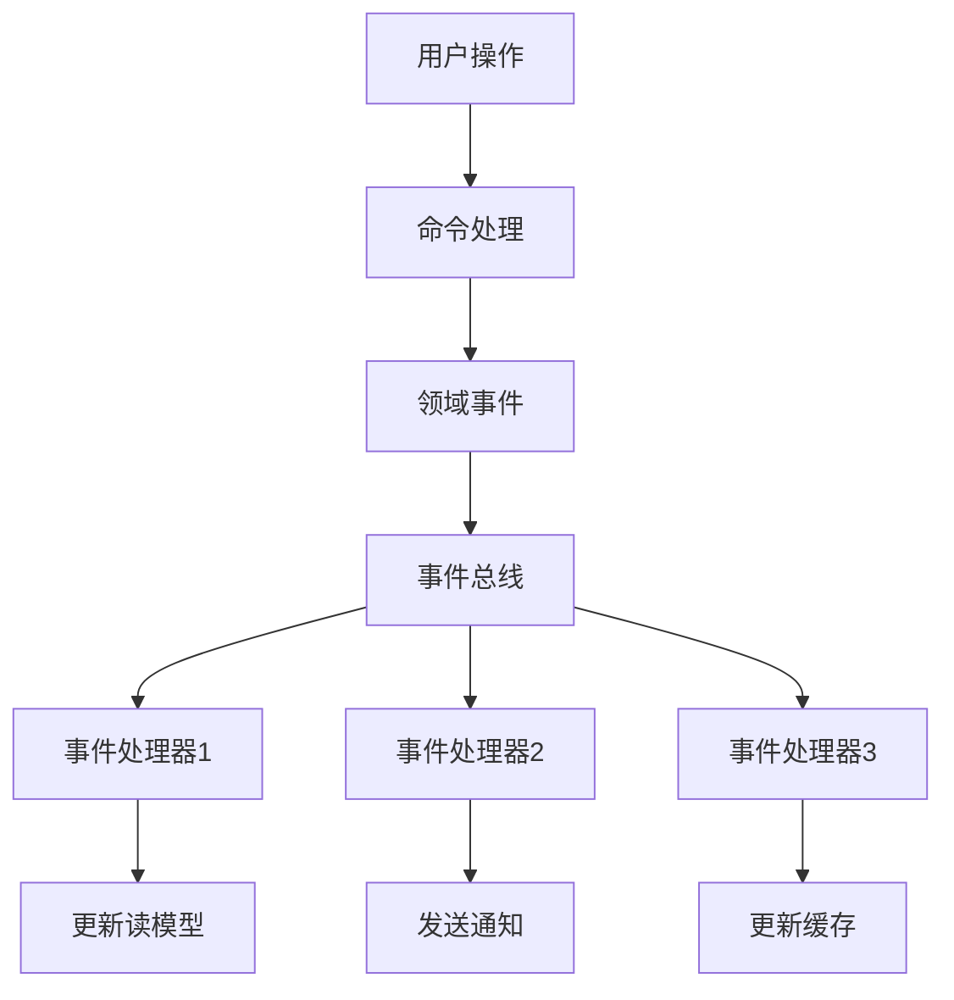

# 架构设计

本文档详细介绍青（Qing）项目的技术架构、设计理念和核心组件。

## 🏗️ 整体架构

### 架构概览

青（Qing）采用微服务架构，基于 Spring Cloud 生态构建，具有高可用、可扩展、易维护的特点。

```
┌─────────────────────────────────────────────────────────────┐
│                        客户端层                              │
├─────────────────────────────────────────────────────────────┤
│  Web 前端    │  移动端 App   │  第三方应用   │  管理后台      │
└─────────────────────────────────────────────────────────────┘
                              │
                              ▼
┌─────────────────────────────────────────────────────────────┐
│                        网关层                                │
├─────────────────────────────────────────────────────────────┤
│              Spring Cloud Gateway                           │
│  • 路由转发  • 负载均衡  • 限流熔断  • 认证鉴权              │
└─────────────────────────────────────────────────────────────┘
                              │
                              ▼
┌─────────────────────────────────────────────────────────────┐
│                        服务层                                │
├─────────────────────────────────────────────────────────────┤
│  认证服务    │  动漫服务     │  用户服务     │  通知服务      │
│  Auth        │  Anime        │  User         │  Notification  │
│  Service     │  Service      │  Service      │  Service       │
└─────────────────────────────────────────────────────────────┘
                              │
                              ▼
┌─────────────────────────────────────────────────────────────┐
│                        基础设施层                            │
├─────────────────────────────────────────────────────────────┤
│  服务注册    │  配置中心     │  消息队列     │  缓存          │
│  Eureka      │  Config       │  RabbitMQ     │  Redis         │
│              │  Server       │               │                │
├─────────────────────────────────────────────────────────────┤
│  数据存储    │  文件存储     │  监控         │  日志          │
│  MySQL       │  MinIO        │  Prometheus   │  ELK Stack     │
│  MongoDB     │  OSS          │  Grafana      │                │
└─────────────────────────────────────────────────────────────┘
```

### 架构特点

#### 🔄 微服务架构

- **服务拆分**: 按业务领域拆分为独立的微服务
- **独立部署**: 每个服务可独立开发、测试、部署
- **技术栈灵活**: 不同服务可选择最适合的技术栈
- **故障隔离**: 单个服务故障不影响整体系统

#### 🌐 云原生设计

- **容器化**: 基于 Docker 容器化部署
- **编排管理**: 支持 Kubernetes 编排
- **弹性伸缩**: 根据负载自动扩缩容
- **服务网格**: 支持 Istio 服务网格

#### 🔐 安全优先

- **零信任架构**: 服务间通信全程加密
- **多层防护**: 网关、服务、数据多层安全防护
- **权限控制**: 基于 RBAC 的细粒度权限控制
- **审计日志**: 完整的操作审计链路

## 🧩 核心组件

### 服务注册与发现

#### Eureka Server

```yaml
# 配置示例
eureka:
  instance:
    hostname: eureka-server
    prefer-ip-address: true
  client:
    register-with-eureka: false
    fetch-registry: false
    service-url:
      defaultZone: http://localhost:8761/eureka/
  server:
    enable-self-preservation: false
    eviction-interval-timer-in-ms: 5000
```

**功能特性**：

- 服务自动注册和发现
- 健康检查和故障转移
- 负载均衡支持
- 集群部署高可用

#### 服务注册流程



### 配置管理

#### Spring Cloud Config

```yaml
# 配置服务器
spring:
  cloud:
    config:
      server:
        git:
          uri: https://github.com/stanic-xyz/qing-config
          search-paths: '{application}'
          clone-on-start: true
        encrypt:
          enabled: true
```

**配置层次结构**：

```
config-repo/
├── application.yml              # 全局配置
├── application-dev.yml          # 开发环境
├── application-test.yml         # 测试环境
├── application-prod.yml         # 生产环境
├── qing-service-anime.yml       # 动漫服务配置
├── qing-service-auth.yml        # 认证服务配置
└── qing-gateway.yml             # 网关配置
```

**配置刷新机制**：

- 支持动态配置刷新
- 基于 Spring Cloud Bus 的配置广播
- 配置变更通知机制

### API 网关

#### Spring Cloud Gateway

```yaml
# 路由配置
spring:
  cloud:
    gateway:
      routes:
        - id: anime-service
          uri: lb://qing-service-anime
          predicates:
            - Path=/api/v1/animes/**
          filters:
            - StripPrefix=2
            - name: RequestRateLimiter
              args:
                redis-rate-limiter.replenishRate: 10
                redis-rate-limiter.burstCapacity: 20
```

**网关功能**：

- 🚦 **路由转发**: 智能路由到后端服务
- ⚖️ **负载均衡**: 多种负载均衡策略
- 🛡️ **限流熔断**: 保护后端服务稳定性
- 🔐 **认证鉴权**: 统一的安全控制入口
- 📊 **监控日志**: 完整的请求链路追踪

#### 网关过滤器链



## 🎯 业务服务设计

### 动漫服务 (Anime Service)

#### 领域模型

```java
// 动漫聚合根
@Entity
@Table(name = "anime")
public class Anime {
    @Id
    @GeneratedValue(strategy = GenerationType.IDENTITY)
    private Long id;
    
    @Column(nullable = false)
    private String name;
    
    @Lob
    private String description;
    
    @ManyToOne(fetch = FetchType.LAZY)
    @JoinColumn(name = "category_id")
    private AnimeCategory category;
    
    @Enumerated(EnumType.STRING)
    private AnimeStatus status;
    
    @OneToMany(mappedBy = "anime", cascade = CascadeType.ALL)
    private List<Episode> episodes;
    
    // 领域方法
    public void updateStatus(AnimeStatus newStatus) {
        // 业务规则验证
        if (this.status == AnimeStatus.COMPLETED && 
            newStatus == AnimeStatus.ONGOING) {
            throw new BusinessException("已完结动漫不能改为连载中");
        }
        this.status = newStatus;
    }
}
```

#### 分层架构

```
┌─────────────────────────────────────┐
│            Controller 层             │
│  • REST API 接口                    │
│  • 参数验证                         │
│  • 异常处理                         │
└─────────────────────────────────────┘
                  │
                  ▼
┌─────────────────────────────────────┐
│            Service 层               │
│  • 业务逻辑处理                     │
│  • 事务管理                         │
│  • 领域服务                         │
└─────────────────────────────────────┘
                  │
                  ▼
┌─────────────────────────────────────┐
│            Repository 层            │
│  • 数据访问抽象                     │
│  • 查询优化                         │
│  • 缓存管理                         │
└─────────────────────────────────────┘
                  │
                  ▼
┌─────────────────────────────────────┐
│            Infrastructure 层        │
│  • 数据库实现                       │
│  • 外部服务集成                     │
│  • 消息发送                         │
└─────────────────────────────────────┘
```

#### CQRS 模式实现

```java
// 命令处理
@Component
public class AnimeCommandHandler {
    
    @Autowired
    private AnimeRepository animeRepository;
    
    @Autowired
    private DomainEventPublisher eventPublisher;
    
    @Transactional
    public void handle(CreateAnimeCommand command) {
        // 1. 业务规则验证
        validateAnimeCreation(command);
        
        // 2. 创建聚合根
        Anime anime = new Anime(command.getName(), 
                               command.getDescription(),
                               command.getCategoryId());
        
        // 3. 保存到数据库
        animeRepository.save(anime);
        
        // 4. 发布领域事件
        eventPublisher.publish(new AnimeCreatedEvent(anime.getId()));
    }
}

// 查询处理
@Component
public class AnimeQueryHandler {
    
    @Autowired
    private AnimeReadModelRepository readModelRepository;
    
    public Page<AnimeListVO> handle(AnimeListQuery query) {
        return readModelRepository.findAnimeList(
            query.getKeyword(),
            query.getCategory(),
            query.getPageable()
        );
    }
}
```

### 认证服务 (Auth Service)

#### JWT 认证架构



#### 安全配置

```java
@Configuration
@EnableWebSecurity
public class SecurityConfig {
    
    @Bean
    public SecurityFilterChain filterChain(HttpSecurity http) throws Exception {
        return http
            .csrf().disable()
            .sessionManagement().sessionCreationPolicy(SessionCreationPolicy.STATELESS)
            .and()
            .authorizeHttpRequests(auth -> auth
                .requestMatchers("/api/v1/auth/login", "/api/v1/auth/register").permitAll()
                .requestMatchers("/api/v1/admin/**").hasRole("ADMIN")
                .anyRequest().authenticated()
            )
            .oauth2ResourceServer().jwt()
            .and()
            .build();
    }
    
    @Bean
    public JwtDecoder jwtDecoder() {
        return NimbusJwtDecoder.withSecretKey(getSecretKey()).build();
    }
}
```

## 💾 数据架构

### 数据库设计

#### 主数据库 (MySQL)

```sql
-- 动漫表
CREATE TABLE anime (
    id BIGINT PRIMARY KEY AUTO_INCREMENT,
    name VARCHAR(255) NOT NULL COMMENT '动漫名称',
    description TEXT COMMENT '动漫描述',
    category_id BIGINT NOT NULL COMMENT '分类ID',
    status ENUM('ONGOING', 'COMPLETED', 'SUSPENDED') NOT NULL COMMENT '状态',
    cover_image VARCHAR(500) COMMENT '封面图片',
    rating DECIMAL(3,1) DEFAULT 0.0 COMMENT '评分',
    episode_count INT DEFAULT 0 COMMENT '集数',
    release_date DATE COMMENT '发布日期',
    create_time TIMESTAMP DEFAULT CURRENT_TIMESTAMP,
    update_time TIMESTAMP DEFAULT CURRENT_TIMESTAMP ON UPDATE CURRENT_TIMESTAMP,
    
    INDEX idx_category_id (category_id),
    INDEX idx_status (status),
    INDEX idx_rating (rating),
    INDEX idx_create_time (create_time),
    FULLTEXT INDEX ft_name_desc (name, description)
) ENGINE=InnoDB DEFAULT CHARSET=utf8mb4 COLLATE=utf8mb4_unicode_ci;

-- 分类表
CREATE TABLE anime_category (
    id BIGINT PRIMARY KEY AUTO_INCREMENT,
    name VARCHAR(100) NOT NULL UNIQUE COMMENT '分类名称',
    description VARCHAR(500) COMMENT '分类描述',
    sort_order INT DEFAULT 0 COMMENT '排序',
    create_time TIMESTAMP DEFAULT CURRENT_TIMESTAMP,
    
    INDEX idx_sort_order (sort_order)
) ENGINE=InnoDB DEFAULT CHARSET=utf8mb4 COLLATE=utf8mb4_unicode_ci;

-- 用户表
CREATE TABLE user (
    id BIGINT PRIMARY KEY AUTO_INCREMENT,
    username VARCHAR(100) NOT NULL UNIQUE COMMENT '用户名',
    password VARCHAR(255) NOT NULL COMMENT '密码',
    email VARCHAR(255) NOT NULL UNIQUE COMMENT '邮箱',
    nickname VARCHAR(100) COMMENT '昵称',
    avatar VARCHAR(500) COMMENT '头像',
    status ENUM('ACTIVE', 'INACTIVE', 'LOCKED') DEFAULT 'ACTIVE' COMMENT '状态',
    last_login_time TIMESTAMP NULL COMMENT '最后登录时间',
    create_time TIMESTAMP DEFAULT CURRENT_TIMESTAMP,
    update_time TIMESTAMP DEFAULT CURRENT_TIMESTAMP ON UPDATE CURRENT_TIMESTAMP,
    
    INDEX idx_email (email),
    INDEX idx_status (status),
    INDEX idx_create_time (create_time)
) ENGINE=InnoDB DEFAULT CHARSET=utf8mb4 COLLATE=utf8mb4_unicode_ci;
```

#### 缓存设计 (Redis)

```yaml
# Redis 数据结构设计

# 用户会话缓存
user:session:{userId}: {
  "token": "jwt-token",
  "refreshToken": "refresh-token",
  "loginTime": "2024-01-01T12:00:00",
  "expireTime": "2024-01-01T13:00:00"
}

# 动漫详情缓存
anime:detail:{animeId}: {
  "id": 1,
  "name": "进击的巨人",
  "description": "...",
  "category": {...},
  "episodes": [...]
}

# 热门动漫排行榜
anime:ranking:hot: [
  {"id": 1, "name": "进击的巨人", "score": 9.5},
  {"id": 2, "name": "鬼灭之刃", "score": 9.3}
]

# 分布式锁
lock:anime:update:{animeId}: "lock-value"

# 限流计数器
rate_limit:{userId}:{api}: {
  "count": 10,
  "window": "2024-01-01T12:00:00"
}
```

#### 搜索引擎 (Elasticsearch)

```json
{
  "mappings": {
    "properties": {
      "id": {"type": "long"},
      "name": {
        "type": "text",
        "analyzer": "ik_max_word",
        "search_analyzer": "ik_smart",
        "fields": {
          "keyword": {"type": "keyword"}
        }
      },
      "description": {
        "type": "text",
        "analyzer": "ik_max_word"
      },
      "category": {
        "type": "nested",
        "properties": {
          "id": {"type": "long"},
          "name": {"type": "keyword"}
        }
      },
      "tags": {"type": "keyword"},
      "rating": {"type": "float"},
      "status": {"type": "keyword"},
      "releaseDate": {"type": "date"},
      "createTime": {"type": "date"}
    }
  }
}
```

### 数据一致性

#### 分布式事务

```java
@Service
@Transactional
public class AnimeService {
    
    @Autowired
    private AnimeRepository animeRepository;
    
    @Autowired
    private SearchService searchService;
    
    @Autowired
    private CacheService cacheService;
    
    // 使用 Saga 模式处理分布式事务
    public void createAnime(CreateAnimeCommand command) {
        try {
            // 1. 保存到数据库
            Anime anime = animeRepository.save(new Anime(command));
            
            // 2. 更新搜索索引
            searchService.indexAnime(anime);
            
            // 3. 清除相关缓存
            cacheService.evictAnimeCache(anime.getCategoryId());
            
            // 4. 发布事件
            eventPublisher.publish(new AnimeCreatedEvent(anime));
            
        } catch (Exception e) {
            // 补偿操作
            compensateAnimeCreation(command);
            throw e;
        }
    }
}
```

#### 最终一致性

```java
// 事件驱动的最终一致性
@EventListener
public class AnimeEventHandler {
    
    @Async
    @Retryable(value = Exception.class, maxAttempts = 3)
    public void handleAnimeCreated(AnimeCreatedEvent event) {
        // 异步更新读模型
        updateAnimeReadModel(event.getAnimeId());
        
        // 异步更新统计信息
        updateCategoryStatistics(event.getCategoryId());
        
        // 异步发送通知
        sendNotification(event);
    }
}
```

## 🔄 消息驱动架构

### 事件驱动设计



### 消息队列配置

```yaml
# RabbitMQ 配置
spring:
  rabbitmq:
    host: localhost
    port: 5672
    username: guest
    password: guest
    virtual-host: /
    publisher-confirms: true
    publisher-returns: true
    listener:
      simple:
        acknowledge-mode: manual
        retry:
          enabled: true
          max-attempts: 3
          initial-interval: 1000
```

```java
// 消息队列配置
@Configuration
public class RabbitConfig {
    
    // 动漫事件交换机
    @Bean
    public TopicExchange animeExchange() {
        return new TopicExchange("anime.exchange", true, false);
    }
    
    // 动漫创建队列
    @Bean
    public Queue animeCreatedQueue() {
        return QueueBuilder.durable("anime.created.queue")
            .withArgument("x-dead-letter-exchange", "anime.dlx")
            .withArgument("x-dead-letter-routing-key", "anime.created.dlq")
            .build();
    }
    
    // 绑定关系
    @Bean
    public Binding animeCreatedBinding() {
        return BindingBuilder
            .bind(animeCreatedQueue())
            .to(animeExchange())
            .with("anime.created");
    }
}
```

## 📊 监控与可观测性

### 监控架构

```
┌─────────────────────────────────────────────────────────────┐
│                        监控层                                │
├─────────────────────────────────────────────────────────────┤
│  Grafana Dashboard  │  Alertmanager  │  Jaeger UI           │
└─────────────────────────────────────────────────────────────┘
                              │
                              ▼
┌─────────────────────────────────────────────────────────────┐
│                        采集层                                │
├─────────────────────────────────────────────────────────────┤
│  Prometheus         │  Jaeger        │  ELK Stack           │
│  • 指标采集         │  • 链路追踪    │  • 日志聚合          │
│  • 时序数据库       │  • 性能分析    │  • 日志分析          │
└─────────────────────────────────────────────────────────────┘
                              │
                              ▼
┌─────────────────────────────────────────────────────────────┐
│                        应用层                                │
├─────────────────────────────────────────────────────────────┤
│  Micrometer         │  OpenTracing   │  Logback             │
│  • 指标暴露         │  • 链路埋点    │  • 结构化日志        │
└─────────────────────────────────────────────────────────────┘
```

### 关键指标

```yaml
# 业务指标
business_metrics:
  - anime_total_count          # 动漫总数
  - anime_created_daily        # 每日新增动漫数
  - user_active_count          # 活跃用户数
  - api_request_rate           # API 请求速率

# 技术指标
technical_metrics:
  - jvm_memory_usage           # JVM 内存使用率
  - database_connection_pool   # 数据库连接池
  - redis_connection_count     # Redis 连接数
  - response_time_percentile   # 响应时间分位数

# 基础设施指标
infrastructure_metrics:
  - cpu_usage_percent          # CPU 使用率
  - memory_usage_percent       # 内存使用率
  - disk_usage_percent         # 磁盘使用率
  - network_io_bytes           # 网络 IO
```

### 链路追踪

```java
@RestController
public class AnimeController {
    
    @Autowired
    private AnimeService animeService;
    
    @GetMapping("/animes/{id}")
    @Traced(operationName = "get-anime-detail")
    public ResponseEntity<AnimeVO> getAnime(@PathVariable Long id) {
        Span span = tracer.nextSpan()
            .name("anime-controller-get-detail")
            .tag("anime.id", String.valueOf(id))
            .start();
        
        try (Tracer.SpanInScope ws = tracer.withSpanInScope(span)) {
            AnimeVO anime = animeService.getAnimeDetail(id);
            span.tag("anime.name", anime.getName());
            return ResponseEntity.ok(anime);
        } catch (Exception e) {
            span.tag("error", e.getMessage());
            throw e;
        } finally {
            span.end();
        }
    }
}
```

## 🚀 性能优化

### 缓存策略

#### 多级缓存架构

```
┌─────────────┐    ┌─────────────┐    ┌─────────────┐
│   浏览器     │    │   CDN       │    │   Nginx     │
│   缓存       │    │   缓存       │    │   缓存       │
└─────────────┘    └─────────────┘    └─────────────┘
       │                   │                   │
       └───────────────────┼───────────────────┘
                           │
                           ▼
┌─────────────┐    ┌─────────────┐    ┌─────────────┐
│  应用缓存    │    │   Redis     │    │   数据库     │
│  (Caffeine) │    │   缓存       │    │   缓存       │
└─────────────┘    └─────────────┘    └─────────────┘
```

#### 缓存实现

```java
@Service
public class AnimeService {
    
    @Cacheable(value = "anime:detail", key = "#id", unless = "#result == null")
    public AnimeVO getAnimeDetail(Long id) {
        return animeRepository.findById(id)
            .map(this::convertToVO)
            .orElse(null);
    }
    
    @CacheEvict(value = "anime:detail", key = "#anime.id")
    @CachePut(value = "anime:list", key = "#anime.categoryId")
    public AnimeVO updateAnime(Anime anime) {
        Anime saved = animeRepository.save(anime);
        return convertToVO(saved);
    }
}
```

### 数据库优化

#### 读写分离

```java
@Configuration
public class DataSourceConfig {
    
    @Bean
    @Primary
    public DataSource dataSource() {
        return new RoutingDataSource();
    }
    
    @Bean
    public DataSource masterDataSource() {
        return DataSourceBuilder.create()
            .url("jdbc:mysql://master:3306/qing")
            .build();
    }
    
    @Bean
    public DataSource slaveDataSource() {
        return DataSourceBuilder.create()
            .url("jdbc:mysql://slave:3306/qing")
            .build();
    }
}

// 动态数据源路由
public class RoutingDataSource extends AbstractRoutingDataSource {
    
    @Override
    protected Object determineCurrentLookupKey() {
        return DataSourceContextHolder.getDataSourceType();
    }
}
```

#### 分库分表

```java
// ShardingSphere 配置
@Configuration
public class ShardingConfig {
    
    @Bean
    public DataSource shardingDataSource() {
        // 分库策略：按用户ID分库
        DatabaseShardingStrategyConfiguration dbStrategy = 
            new DatabaseShardingStrategyConfiguration(
                "user_id", 
                new UserDatabaseShardingAlgorithm()
            );
        
        // 分表策略：按创建时间分表
        TableShardingStrategyConfiguration tableStrategy = 
            new TableShardingStrategyConfiguration(
                "create_time", 
                new TimeBasedTableShardingAlgorithm()
            );
        
        return ShardingDataSourceFactory.createDataSource(
            createDataSourceMap(), 
            createShardingRuleConfig(dbStrategy, tableStrategy), 
            new Properties()
        );
    }
}
```

### 异步处理

```java
@Service
public class AnimeService {
    
    @Async("taskExecutor")
    @Retryable(value = Exception.class, maxAttempts = 3)
    public CompletableFuture<Void> processAnimeAsync(Long animeId) {
        // 异步处理动漫相关任务
        // 1. 生成缩略图
        generateThumbnail(animeId);
        
        // 2. 更新搜索索引
        updateSearchIndex(animeId);
        
        // 3. 发送通知
        sendNotification(animeId);
        
        return CompletableFuture.completedFuture(null);
    }
}

@Configuration
@EnableAsync
public class AsyncConfig {
    
    @Bean("taskExecutor")
    public TaskExecutor taskExecutor() {
        ThreadPoolTaskExecutor executor = new ThreadPoolTaskExecutor();
        executor.setCorePoolSize(10);
        executor.setMaxPoolSize(50);
        executor.setQueueCapacity(200);
        executor.setThreadNamePrefix("async-task-");
        executor.setRejectedExecutionHandler(new ThreadPoolExecutor.CallerRunsPolicy());
        executor.initialize();
        return executor;
    }
}
```

## 🔒 安全架构

### 安全防护体系

```
┌─────────────────────────────────────────────────────────────┐
│                        安全防护层                            │
├─────────────────────────────────────────────────────────────┤
│  WAF        │  DDoS 防护   │  IP 白名单   │  SSL/TLS       │
└─────────────────────────────────────────────────────────────┘
                              │
                              ▼
┌─────────────────────────────────────────────────────────────┐
│                        网关安全层                            │
├─────────────────────────────────────────────────────────────┤
│  认证鉴权    │  限流熔断     │  参数校验     │  日志审计      │
└─────────────────────────────────────────────────────────────┘
                              │
                              ▼
┌─────────────────────────────────────────────────────────────┐
│                        应用安全层                            │
├─────────────────────────────────────────────────────────────┤
│  输入验证    │  SQL 注入防护 │  XSS 防护    │  CSRF 防护     │
└─────────────────────────────────────────────────────────────┘
                              │
                              ▼
┌─────────────────────────────────────────────────────────────┐
│                        数据安全层                            │
├─────────────────────────────────────────────────────────────┤
│  数据加密    │  访问控制     │  备份恢复     │  审计日志      │
└─────────────────────────────────────────────────────────────┘
```

### 权限控制模型

```java
// RBAC 权限模型
@Entity
public class User {
    @ManyToMany(fetch = FetchType.LAZY)
    @JoinTable(name = "user_role",
               joinColumns = @JoinColumn(name = "user_id"),
               inverseJoinColumns = @JoinColumn(name = "role_id"))
    private Set<Role> roles;
}

@Entity
public class Role {
    @ManyToMany(fetch = FetchType.LAZY)
    @JoinTable(name = "role_permission",
               joinColumns = @JoinColumn(name = "role_id"),
               inverseJoinColumns = @JoinColumn(name = "permission_id"))
    private Set<Permission> permissions;
}

@Entity
public class Permission {
    private String resource;  // 资源
    private String action;    // 操作
    private String effect;    // 效果：ALLOW/DENY
}
```

## 📚 相关资源

- [快速开始](../tutorial-basics/getting-started) - 项目安装和启动指南
- [API 文档](./api-docs) - 详细的 API 接口文档
- [开发指南](./development) - 开发规范和最佳实践
- [部署指南](../tutorial-basics/deployment) - 生产环境部署指南

## 🆘 获取帮助

如果对架构设计有疑问，可以通过以下方式获取帮助：

- 📖 查看完整文档
- 🐛 [提交 Issue](https://github.com/stanic-xyz/qing/issues)
- 💬 [参与讨论](https://github.com/stanic-xyz/qing/discussions)
- 📧 发送邮件：support@example.com

---

> 💡 **提示**：架构设计会随着业务发展持续演进，建议定期回顾和优化。所有设计决策都应该基于实际业务需求和技术约束。
