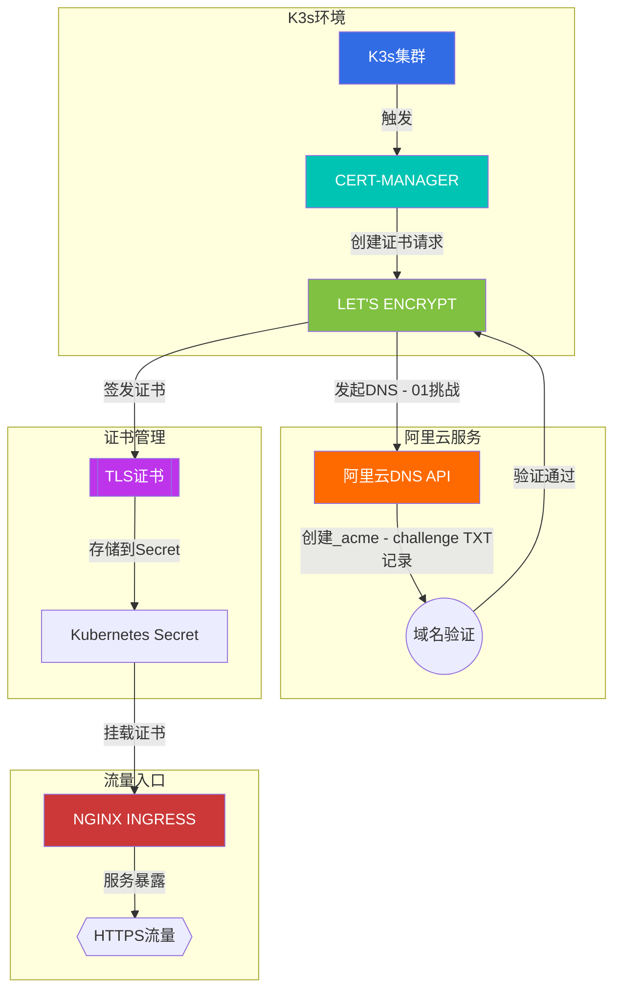
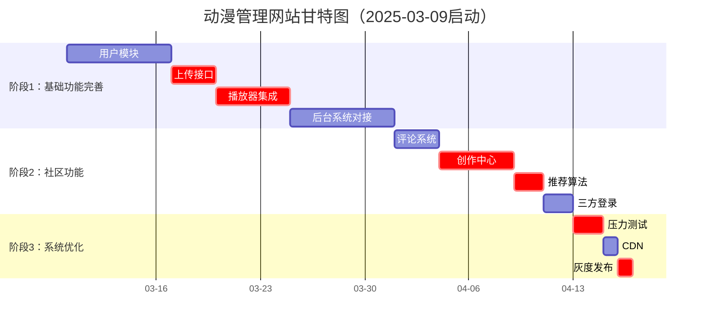
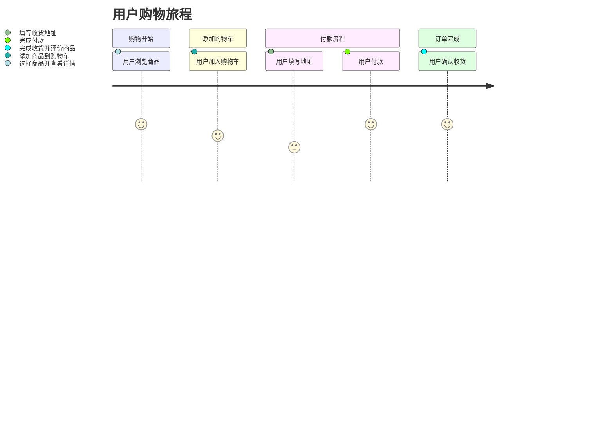
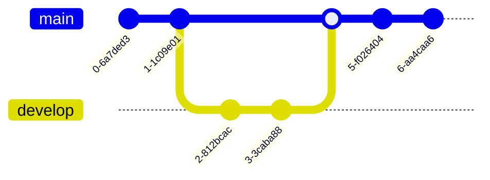
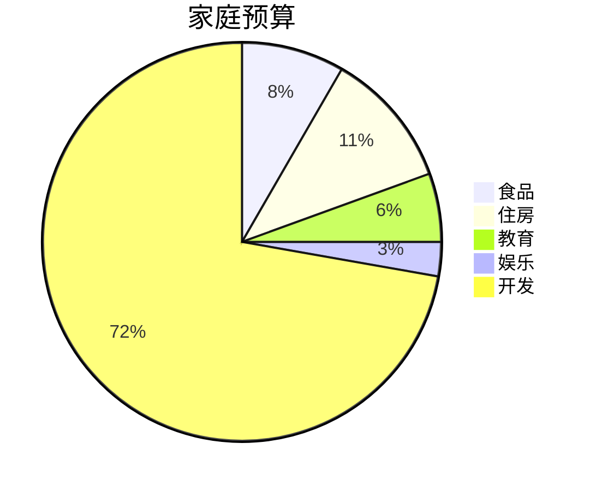
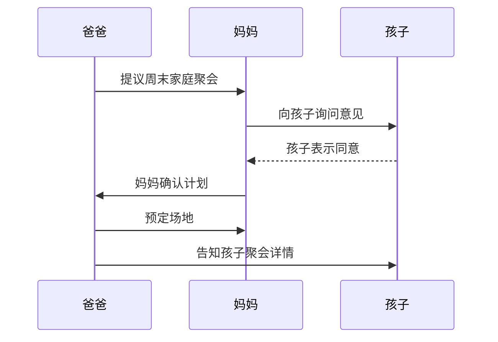

# K3s环境使用Let's Encrypt证书的部署及自动配置HTTPS域名

## ——阿里云域名解析管理全流程实践指南

*最后更新：2025年02月26日 | 预计阅读时间：15分钟*

---

### 引言

在边缘计算和轻量化Kubernetes场景中，K3s凭借其轻量级特性广受者青睐。但如何在K3s集群中实现HTTPS证书的自动化管理，仍是许多团队面临的挑战。本文将以**阿里云DNS服务**为核心，结合**Cert-Manager**与**Let's Encrypt**，详细解析在K3s环境下实现泛域名证书自动申请、部署与续期的完整方案[7,9](@ref)。

---

### 一、技术架构解析

#### 1.1 核心组件协作流程

