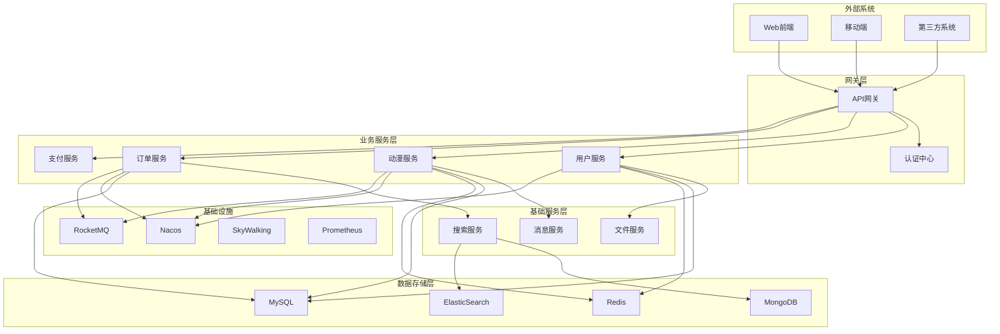
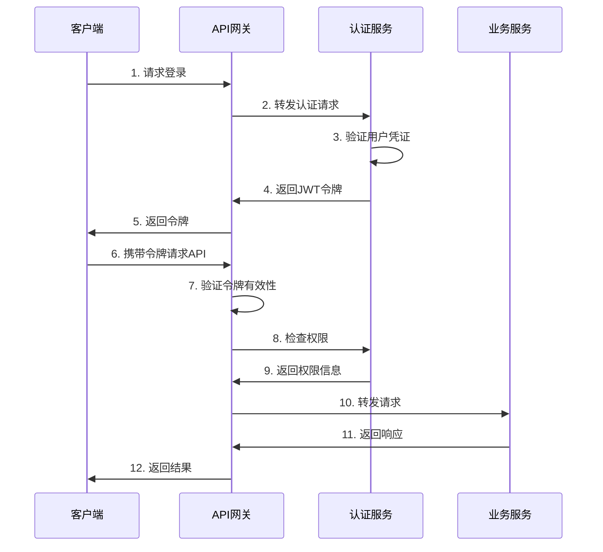
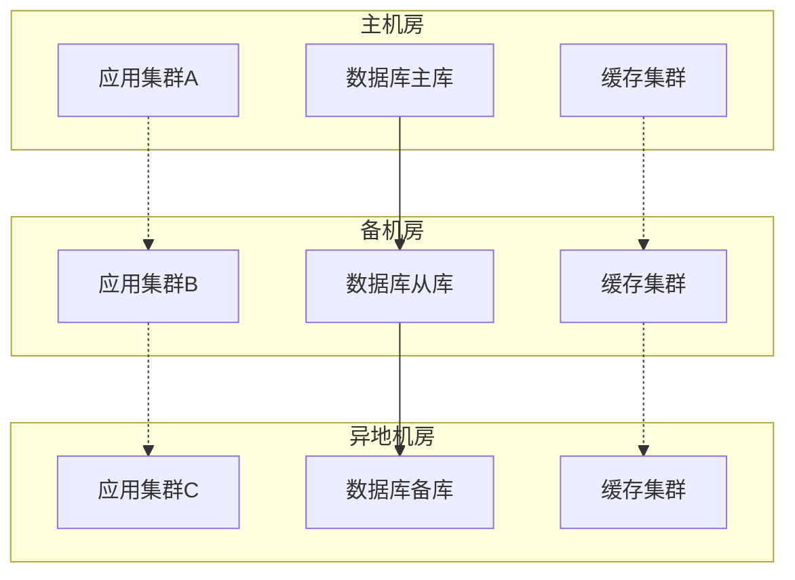
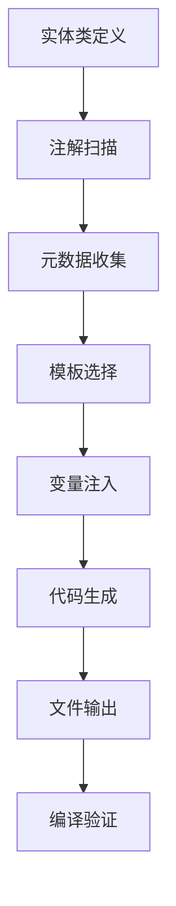
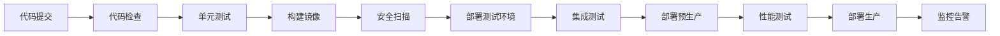

# 架构设计

> 🏗️ Project-青微服务平台架构设计与技术选型

## 📖 概述

Project-青是一个基于Spring Cloud的现代化微服务平台，采用领域驱动设计（DDD）理念，提供完整的企业级应用开发解决方案。

### 设计目标

- **🎯 高性能**: 支持高并发、低延迟的业务场景
- **🔧 可扩展**: 模块化设计，支持水平扩展
- **🛡️ 高可用**: 多层容错机制，保障系统稳定性
- **⚡ 高效率**: 智能代码生成，提升开发效率
- **🔒 安全性**: 完善的认证授权体系
- **📊 可观测**: 全链路监控和日志追踪

## 🏛️ 整体架构

### 架构分层

```
┌─────────────────────────────────────────────────────────────┐
│                        用户层                                │
├─────────────────────────────────────────────────────────────┤
│  Web前端    │  移动端APP   │  第三方系统   │  管理后台        │
└─────────────────────────────────────────────────────────────┘
                              ↓
┌─────────────────────────────────────────────────────────────┐
│                      接入层                                  │
├─────────────────────────────────────────────────────────────┤
│           CDN          │        负载均衡器                   │
└─────────────────────────────────────────────────────────────┘
                              ↓
┌─────────────────────────────────────────────────────────────┐
│                      网关层                                  │
├─────────────────────────────────────────────────────────────┤
│  API网关(Gateway)  │  认证授权  │  限流熔断  │  路由转发      │
└─────────────────────────────────────────────────────────────┘
                              ↓
┌─────────────────────────────────────────────────────────────┐
│                    微服务层                                  │
├─────────────────────────────────────────────────────────────┤
│  认证服务  │  用户服务  │  动漫服务  │  订单服务  │  ...       │
└─────────────────────────────────────────────────────────────┘
                              ↓
┌─────────────────────────────────────────────────────────────┐
│                    数据层                                    │
├─────────────────────────────────────────────────────────────┤
│   MySQL    │   Redis    │   MongoDB   │   ElasticSearch     │
└─────────────────────────────────────────────────────────────┘
                              ↓
┌─────────────────────────────────────────────────────────────┐
│                  基础设施层                                  │
├─────────────────────────────────────────────────────────────┤
│  服务注册  │  配置中心  │  消息队列  │  监控告警  │  日志收集  │
└─────────────────────────────────────────────────────────────┘
```

### 核心组件

| 组件类型 | 技术选型 | 作用 |
|----------|----------|------|
| **服务注册与发现** | Nacos | 服务注册、配置管理、服务发现 |
| **API网关** | Spring Cloud Gateway | 统一入口、路由转发、认证授权 |
| **负载均衡** | Spring Cloud LoadBalancer | 客户端负载均衡 |
| **熔断降级** | Sentinel | 流量控制、熔断降级、系统保护 |
| **认证授权** | Sa-Token | JWT令牌、权限控制、单点登录 |
| **远程调用** | OpenFeign | 声明式HTTP客户端 |
| **消息队列** | RocketMQ | 异步消息、事件驱动 |
| **分布式事务** | Seata | 分布式事务解决方案 |
| **链路追踪** | SkyWalking | 分布式链路追踪 |
| **监控告警** | Prometheus + Grafana | 指标监控、可视化 |

## 🎯 领域驱动设计

### DDD分层架构

```
┌─────────────────────────────────────────────────────────────┐
│                    用户接口层 (Interfaces)                   │
├─────────────────────────────────────────────────────────────┤
│  Controller  │  DTO  │  Assembler  │  Facade               │
└─────────────────────────────────────────────────────────────┘
                              ↓
┌─────────────────────────────────────────────────────────────┐
│                    应用服务层 (Application)                  │
├─────────────────────────────────────────────────────────────┤
│  ApplicationService  │  Command  │  Query  │  EventHandler  │
└─────────────────────────────────────────────────────────────┘
                              ↓
┌─────────────────────────────────────────────────────────────┐
│                    领域层 (Domain)                          │
├─────────────────────────────────────────────────────────────┤
│  Entity  │  ValueObject  │  DomainService  │  Repository    │
│  Aggregate  │  DomainEvent  │  Specification               │
└─────────────────────────────────────────────────────────────┘
                              ↓
┌─────────────────────────────────────────────────────────────┐
│                  基础设施层 (Infrastructure)                 │
├─────────────────────────────────────────────────────────────┤
│  RepositoryImpl  │  MessageProducer  │  ExternalService     │
│  Configuration  │  Mapper  │  Cache                        │
└─────────────────────────────────────────────────────────────┘
```

### 包结构设计

```
qing-service-xxx/
├── src/main/java/cn/chenyunlong/qing/xxx/
│   ├── interfaces/           # 用户接口层
│   │   ├── controller/       # REST控制器
│   │   ├── dto/             # 数据传输对象
│   │   └── assembler/       # 对象转换器
│   ├── application/         # 应用服务层
│   │   ├── service/         # 应用服务
│   │   ├── command/         # 命令对象
│   │   ├── query/           # 查询对象
│   │   └── handler/         # 事件处理器
│   ├── domain/              # 领域层
│   │   ├── entity/          # 实体
│   │   ├── valueobject/     # 值对象
│   │   ├── service/         # 领域服务
│   │   ├── repository/      # 仓储接口
│   │   └── event/           # 领域事件
│   └── infrastructure/      # 基础设施层
│       ├── repository/      # 仓储实现
│       ├── config/          # 配置类
│       ├── mapper/          # 数据映射
│       └── external/        # 外部服务
└── src/main/resources/
    ├── application.yml      # 应用配置
    ├── bootstrap.yml        # 启动配置
    └── mapper/              # MyBatis映射文件
```

## 🔧 技术架构

### 服务架构图



### 数据架构

#### 数据分层策略

| 数据层 | 存储技术 | 用途 | 特点 |
|--------|----------|------|------|
| **缓存层** | Redis | 热点数据、会话存储 | 高性能、易失性 |
| **业务数据层** | MySQL | 核心业务数据 | ACID、强一致性 |
| **文档数据层** | MongoDB | 非结构化数据 | 灵活schema、水平扩展 |
| **搜索数据层** | ElasticSearch | 全文检索、日志分析 | 实时搜索、聚合分析 |
| **时序数据层** | InfluxDB | 监控指标、日志 | 时序优化、压缩存储 |

#### 数据一致性策略

```
┌─────────────────────────────────────────────────────────────┐
│                    数据一致性保障                            │
├─────────────────────────────────────────────────────────────┤
│  强一致性     │  最终一致性   │  弱一致性                    │
│  (核心业务)   │  (辅助数据)   │  (缓存数据)                  │
├─────────────────────────────────────────────────────────────┤
│  • 用户账户   │  • 统计数据   │  • 页面缓存                  │
│  • 订单信息   │  • 搜索索引   │  • 会话数据                  │
│  • 支付记录   │  • 日志数据   │  • 临时数据                  │
└─────────────────────────────────────────────────────────────┘
```

## 🛡️ 安全架构

### 安全防护体系

```
┌─────────────────────────────────────────────────────────────┐
│                      安全防护层次                            │
├─────────────────────────────────────────────────────────────┤
│  网络安全     │  应用安全     │  数据安全     │  运维安全    │
├─────────────────────────────────────────────────────────────┤
│  • 防火墙     │  • 身份认证   │  • 数据加密   │  • 访问控制  │
│  • WAF        │  • 权限控制   │  • 数据脱敏   │  • 审计日志  │
│  • DDoS防护   │  • 输入验证   │  • 备份恢复   │  • 安全监控  │
│  • SSL/TLS    │  • 会话管理   │  • 数据隔离   │  • 应急响应  │
└─────────────────────────────────────────────────────────────┘
```

### 认证授权流程



## ⚡ 性能架构

### 性能优化策略

#### 缓存策略

```
┌─────────────────────────────────────────────────────────────┐
│                      多级缓存架构                            │
├─────────────────────────────────────────────────────────────┤
│  L1: 本地缓存    │  L2: 分布式缓存  │  L3: 数据库缓存      │
│  (Caffeine)      │  (Redis)         │  (MySQL Buffer)      │
├─────────────────────────────────────────────────────────────┤
│  • 热点数据      │  • 会话数据      │  • 查询结果缓存      │
│  • 配置信息      │  • 业务缓存      │  • 索引缓存          │
│  • 计算结果      │  • 分布式锁      │  • 页面缓存          │
└─────────────────────────────────────────────────────────────┘
```

#### 数据库优化

| 优化策略 | 实现方式 | 适用场景 |
|----------|----------|----------|
| **读写分离** | MySQL主从复制 | 读多写少场景 |
| **分库分表** | ShardingSphere | 大数据量场景 |
| **连接池优化** | HikariCP | 高并发场景 |
| **索引优化** | 复合索引、覆盖索引 | 查询优化 |
| **SQL优化** | 慢查询分析 | 性能调优 |

### 监控指标

```
┌─────────────────────────────────────────────────────────────┐
│                    关键性能指标                              │
├─────────────────────────────────────────────────────────────┤
│  业务指标        │  技术指标        │  基础设施指标        │
├─────────────────────────────────────────────────────────────┤
│  • QPS/TPS       │  • 响应时间      │  • CPU使用率         │
│  • 成功率        │  • 错误率        │  • 内存使用率        │
│  • 用户活跃度    │  • 并发数        │  • 磁盘I/O           │
│  • 转化率        │  • 吞吐量        │  • 网络带宽          │
└─────────────────────────────────────────────────────────────┘
```

## 🔄 扩展架构

### 水平扩展策略

```
┌─────────────────────────────────────────────────────────────┐
│                    扩展维度                                  │
├─────────────────────────────────────────────────────────────┤
│  服务扩展        │  数据扩展        │  缓存扩展            │
├─────────────────────────────────────────────────────────────┤
│  • 实例扩展      │  • 读写分离      │  • Redis集群         │
│  • 集群部署      │  • 分库分表      │  • 缓存分片          │
│  • 负载均衡      │  • 数据归档      │  • 多级缓存          │
│  • 自动伸缩      │  • 冷热分离      │  • 缓存预热          │
└─────────────────────────────────────────────────────────────┘
```

### 容灾架构



## 🎨 代码生成架构

### 代码生成器设计

```
┌─────────────────────────────────────────────────────────────┐
│                  代码生成器架构                              │
├─────────────────────────────────────────────────────────────┤
│  注解处理器      │  模板引擎        │  代码生成器          │
├─────────────────────────────────────────────────────────────┤
│  • @GenCode      │  • Velocity      │  • Controller生成    │
│  • @GenField     │  • 模板管理      │  • Service生成       │
│  • 元数据收集    │  • 变量注入      │  • Repository生成    │
│  • 类型分析      │  • 代码格式化    │  • DTO生成           │
└─────────────────────────────────────────────────────────────┘
```

### 生成流程



## 📊 监控架构

### 可观测性体系

```
┌─────────────────────────────────────────────────────────────┐
│                    可观测性三大支柱                          │
├─────────────────────────────────────────────────────────────┤
│  Metrics(指标)   │  Logging(日志)   │  Tracing(链路)       │
├─────────────────────────────────────────────────────────────┤
│  • Prometheus    │  • ELK Stack     │  • SkyWalking        │
│  • Grafana       │  • 结构化日志    │  • Jaeger            │
│  • 自定义指标    │  • 日志聚合      │  • 分布式追踪        │
│  • 告警规则      │  • 日志分析      │  • 性能分析          │
└─────────────────────────────────────────────────────────────┘
```

### 监控大盘

| 监控类型 | 监控工具 | 关键指标 |
|----------|----------|----------|
| **应用监控** | Spring Boot Actuator | JVM指标、HTTP指标、自定义指标 |
| **服务监控** | Prometheus + Grafana | QPS、响应时间、错误率 |
| **基础设施监控** | Node Exporter | CPU、内存、磁盘、网络 |
| **业务监控** | 自定义指标 | 用户行为、业务转化率 |
| **日志监控** | ELK Stack | 错误日志、访问日志、业务日志 |
| **链路监控** | SkyWalking | 调用链路、性能瓶颈、依赖关系 |

## 🚀 部署架构

### 容器化部署

```
┌─────────────────────────────────────────────────────────────┐
│                    容器化架构                                │
├─────────────────────────────────────────────────────────────┤
│  开发环境        │  测试环境        │  生产环境            │
├─────────────────────────────────────────────────────────────┤
│  • Docker        │  • Docker        │  • Kubernetes        │
│  • 本地开发      │  • 自动化测试    │  • 集群部署          │
│  • 快速启动      │  • 环境隔离      │  • 自动扩缩容        │
│  • 调试便利      │  • 持续集成      │  • 滚动更新          │
└─────────────────────────────────────────────────────────────┘
```

### CI/CD流水线



## 🔮 技术演进

### 技术选型原则

1. **稳定性优先**: 选择成熟稳定的技术栈
2. **社区活跃**: 优先选择社区活跃的开源项目
3. **性能考量**: 关注技术的性能表现
4. **学习成本**: 考虑团队的学习和维护成本
5. **生态完整**: 选择生态完整的技术体系

### 架构演进路线

```
┌─────────────────────────────────────────────────────────────┐
│                    架构演进时间线                            │
├─────────────────────────────────────────────────────────────┤
│  V1.0 单体应用   │  V2.0 微服务化   │  V3.0 云原生        │
├─────────────────────────────────────────────────────────────┤
│  • Spring Boot   │  • Spring Cloud  │  • Kubernetes        │
│  • 单一数据库    │  • 服务拆分      │  • Service Mesh      │
│  • 简单部署      │  • 分布式架构    │  • Serverless        │
│  • 快速开发      │  • 微服务治理    │  • 边缘计算          │
└─────────────────────────────────────────────────────────────┘
```

## 📚 相关文档

- [快速开始](快速开始.md) - 5分钟快速上手指南
- [用户指南](用户指南.md) - 详细使用说明
- [部署指南](部署指南.md) - 生产环境部署
- [ROADMAP](../ROADMAP.md) - 项目发展路线
- [CONTRIBUTING](../CONTRIBUTING.md) - 贡献指南

---

> 💡 **设计理念**: 简单、高效、可扩展。我们相信好的架构应该是简单易懂的，同时具备足够的扩展性来应对业务的快速发展。